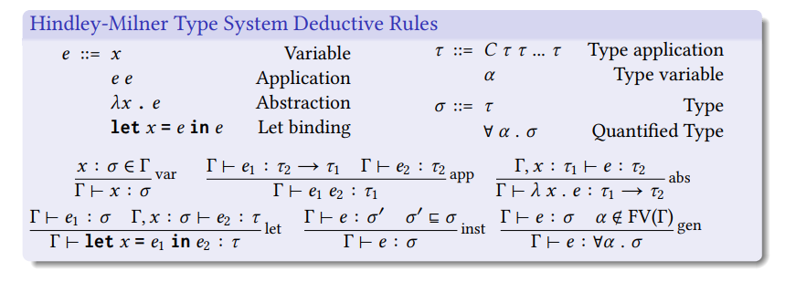
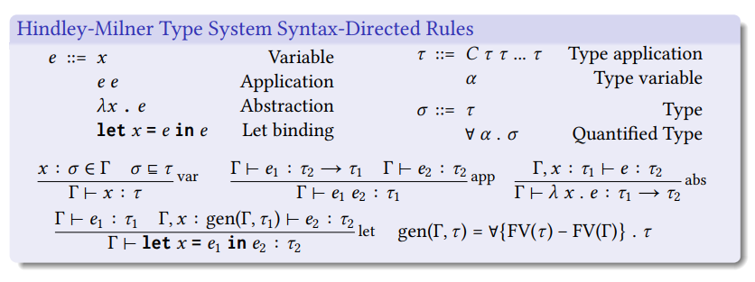

For reference:





1) App rule

   ```
   App Expr Expr
   (App (arg1 :: X1) (arg2 :: X2)) :: X3
   ```

   Since we are applying `arg1` to `arg2`, `arg1` must be a function, so it must have a type like `A -> B`.

   Suppose then `arg1` :: `A -> B`.

   Since `arg1` takes `arg2` as input, the type of `arg2` must be the same as the type `A`.

   After applying `arg1` to `arg2`, the result of their application must be the return type of `arg1`, type `B`.

   Prolog Constraints:

   ```
   arrow(X1),
   fst(X1,X2),
   snd(X1, X3).
   ```

   

2) Let rule

   ```
   Let Var Expr Expr
   (Let ((Var "someName") :: X1) (arg2 :: X2) (arg3 :: X3)) :: X4
   ```

   Since `arg1` is assigned the value of `arg2`, the types of `arg1` and `arg2` must match.

   The type of a let expression is the type of its body.

   Let's make sure to add the binder to our table, marked with its node number and distinguishing it with the fact that it was defined by a let, not a lambda: `addToTable("someName", node_number, Binder)`.

   Prolog Constraints:

   ```
   X1 = X2,
   X4 = X3.
   ```

   

3) Var Rule

   ```
   (Var "someName") :: X1
   ```

   Let's look up the variable in our table.

   - Case 1: `lookup("someName")` returns `(node_id, Binder)`

     ```
     Node-to-Type table
     _____________________
     Node ID | Type Var(s)           
     1       | A
     ...
     node_id | J
     
     Var-to-Node Table
     ____________________________________
     "Var name" | Node ID | Arg or Binder? 
     "someName" | node_id | Binder
     ```

     Then we know "someName" was defined by a let expression and could be polymorphic. Therefore this instance of "someName" must *instantiate* the type of node_id.

     Prolog Constraints:

     ```
     copy_term(J,X1).
     ```

     

   - Case 2: `lookup("someName")` returns `(node_id, Arg)`

     ```
     Node-to-Type table
     _____________________
     Node ID | Type Var(s)           
     1       | A
     ...
     node_id | J
     
     Var-to-Node Table
     ____________________________________
     "Var name" | Node ID | Arg or Binder? 
     "someName" | node_id | Arg
     ```

     

     Then we know "someName" was defined by a lambda expression and cannot be polymorphic. Therefore this instance of "someName" must be the same as the type of node_id.

     Prolog Constraints:

     ```
     X1 = J.
     ```

4) Primitive Rule

   ```
   (Lit 5) :: X2
   ```

   Prolog Constraints:

   ```
   X2 = int.
   ```

   

5) Lambda Rule?

6) Fix operator???

   