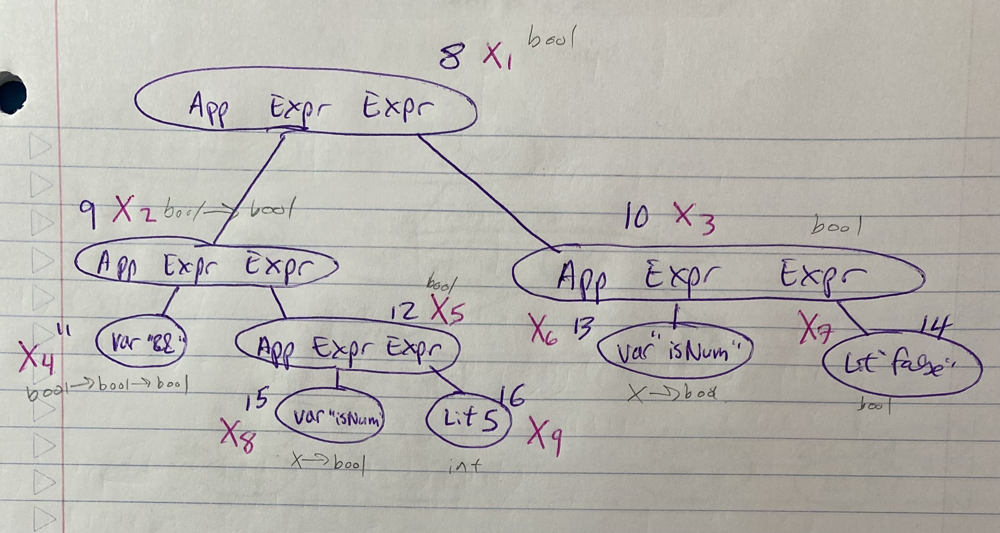

```
main = isNum(5) && isNum(false).
```


```
Typechecking...
_______________________
Func name | Type Scheme
"add"     | For every [], [int, int, int] ----------> hasTypeScheme(add,[],[int, [int, int]]).
_____________________
Node ID | Type Var(s)           


main_typechecks() :- ...

Traverse AST Tree to typecheck sup...
____________________________________
Var name | Node ID | Arg or Binder? 


```

Prolog constraints for typechecking main collected together (full file [here](../prolog/main.pl)):

```prolog
% language specific
hasTypeScheme(and,[],[bool,[bool,bool]]).
hasTypeScheme(isBool,[X],[X,bool]).
hasTypeScheme(isNum,[X],[X,bool]).

% program specific
main_typechecks(X1,X2,X3,X4,X5,X6,X7,X8,X9):- 
 arrow(X2), snd(X2,X1), fst(X2,X3),
 arrow(X4), snd(X4,X2), fst(X4,X5),
 arrow(X8), snd(X8, X5), fst(X8,X9),
 arrow(X6), snd(X6,X3), fst(X6,X7), 
 instantiates(X4, and), instantiates(X8, isNum), instantiates(X13, isNum),
 X9=int,X7=bool.

hasType(node_8, X1) :- main_typechecks(X1,_,_,_,_,_,_,_,_).
hasType(node_9, X2) :- main_typechecks(_,X2,_,_,_,_,_,_,_).
hasType(node_10, X3) :- main_typechecks(_,_,X3,_,_,_,_,_,_).
hasType(node_11, X4) :- main_typechecks(_,_,_,X4,_,_,_,_,_).
hasType(node_12, X5) :- main_typechecks(_,_,_,_,X5,_,_,_,_).
hasType(node_13, X6) :- main_typechecks(_,_,_,_,_,X6,_,_,_).
hasType(node_14, X7) :- main_typechecks(_,_,_,_,_,_,X7,_,_).
hasType(node_15, X8) :- main_typechecks(_,_,_,_,_,_,_,X8,_).
hasType(node_16, X9) :- main_typechecks(_,_,_,_,_,_,_,_,X9).
```

