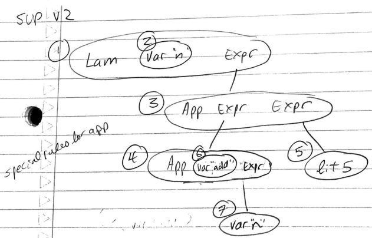

```
sup n = {
    n + 5 // where we assume + is a built in func instead of a primitive operator
}
```


```
Typechecking...
_______________________
Func name | Type Scheme
"add"     | For every [], [int, int, int] ----------> hasTypeScheme(add,[],[int, [int, int]]).
_____________________
Node ID | Type Var(s)           
1       | A                     --------------------> hasType(node_1, A):- sup_typechecks(A,_,_,_,_,_,_).
2       | C                     --------------------> hasType(node_2, C):- sup_typechecks(_,C,_,_,_,_,_).
3       | D                     --------------------> hasType(node_3, D):- sup_typechecks(_,_,D,_,_,_,_).
4       | E                     --------------------> hasType(node_4, E):- sup_typechecks(_,_,_,E,_,_,_).
5       | F                     --------------------> hasType(node_5, F):- sup_typechecks(_,_,_,_,F,_,_).
6       | G                     --------------------> hasType(node_6, G):- sup_typechecks(_,_,_,_,_,G,_).
7       | H                     --------------------> hasType(node_7, H):- sup_typechecks(_,_,_,_,_,_,H).

sup_typechecks(A,B,C,D,E,F,G,H) :- ...

Traverse AST Tree to typecheck sup...
____________________________________
Var name | Node ID | Arg or Binder? 
"n"      | 2       | arg

Node 1 (lam var expr):
- Lambda nodes have arrow type  --------------------> arrow(A)
- [node 2, node 3] = node 1     --------------------> [C, D] = A
- add arg "n" to var table      --------------------> n/a

Node 2 (var):
- node 2 = lookup("n")          --------------------> C = C

Node 3 (App expr expr):
- LHS must be an arrow type    --------------------> arrow(E)
- fst node 4 = node 5          --------------------> fst(E,F)
- snd node 4 = node 3          --------------------> snd(E,D)

Node 4 (App var expr):
- LHS must be an arrow type    --------------------> arrow(G)
- fst node 6 = node 7          --------------------> fst(G,H)
- snd node 6 = node 4          --------------------> snd(G,E)
Node 6 (var):
- node 6 = lookupFunc("add")   --------------------> instantiates(G,add)

Node 7 (var):
- node 7 = lookup("n")         --------------------> H = C

Node 5 (lit):
- node 5  = int                --------------------> F = int
```

Prolog constraints for typechecking sup collected together (full file [here](../prolog/supv2.pl)):

```prolog
% language specific
hasTypeScheme(add,[],[int, [int, int]]).

% program specific
sup_typechecks(A,C,D,E,F,G,H) :-
 [C, D] = A, arrow(A),
 arrow(E), fst(E,F), snd(E,D),
 arrow(G), fst(G,H), snd(G,E),
 instantiates(G,add), H = C, F = int.

hasType(node_1, A):- sup_typechecks(A,_,_,_,_,_,_).
hasType(node_2, C):- sup_typechecks(_,C,_,_,_,_,_).
hasType(node_3, D):- sup_typechecks(_,_,D,_,_,_,_).
hasType(node_4, E):- sup_typechecks(_,_,_,E,_,_,_).
hasType(node_5, F):- sup_typechecks(_,_,_,_,F,_,_).
hasType(node_6, G):- sup_typechecks(_,_,_,_,_,G,_).
hasType(node_7, H):- sup_typechecks(_,_,_,_,_,_,H).
```

