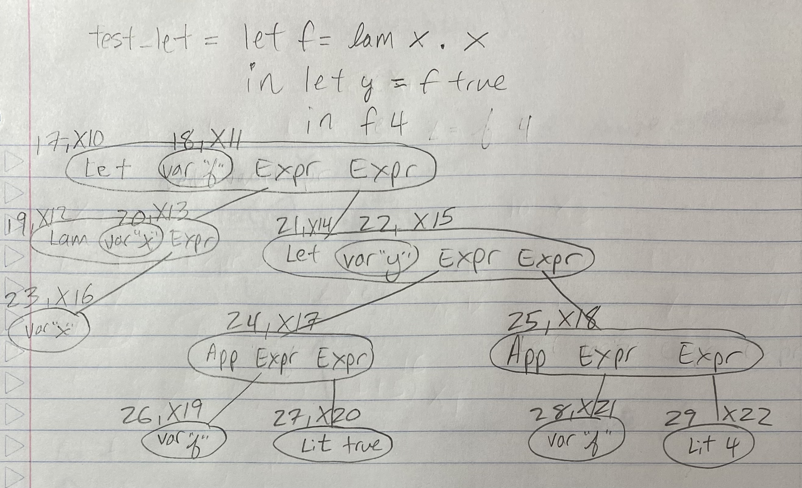

```
test_let = let f = lam x .x in let y =  f true in f 4
```


```
Typechecking...
_______________________
Func name | Type Scheme

_____________________
Node ID | Type Var(s)           


test_let_typechecks() :- ...

Traverse AST Tree to typecheck sup...
____________________________________
Var name | Node ID | Arg or Binder? 


```

Prolog constraints for typechecking test_let collected together (full file [here](../prolog/test_let.pl)):

```prolog
% language specific

% program specific
test_let_typechecks(X10,X11,X12,X13,X14,X15,X16,X17,X18,X19,X20,X21,X22):-
X11=X12, X10=X14, 
X12=[X16,X13],
X15=X17, X14=X18,
arrow(X19), fst(X19,X20), snd(X19,X17),
arrow(X21), fst(X21,X22), snd(X21,X18),
X20=bool, X22=int, X16=X13, copy_term(X11,X21), copy_term(X11,X19).

hasType(node_17,X10) :- test_let_typechecks(X10,_,_,_,_,_,_,_,_,_,_,_,_).
hasType(node_18,X11) :- test_let_typechecks(_,X11,_,_,_,_,_,_,_,_,_,_,_).
hasType(node_19,X12) :- test_let_typechecks(_,_,X12,_,_,_,_,_,_,_,_,_,_).
hasType(node_20,X13) :- test_let_typechecks(_,_,_,X13,_,_,_,_,_,_,_,_,_).
hasType(node_21,X14) :- test_let_typechecks(_,_,_,_,X14,_,_,_,_,_,_,_,_).
hasType(node_22,X15) :- test_let_typechecks(_,_,_,_,_,X15,_,_,_,_,_,_,_).
hasType(node_23,X16) :- test_let_typechecks(_,_,_,_,_,_,X16,_,_,_,_,_,_).
hasType(node_24,X17) :- test_let_typechecks(_,_,_,_,_,_,_,X17,_,_,_,_,_).
hasType(node_25,X18) :- test_let_typechecks(_,_,_,_,_,_,_,_,X18,_,_,_,_).
hasType(node_26,X19) :- test_let_typechecks(_,_,_,_,_,_,_,_,_,X19,_,_,_).
hasType(node_27,X20) :- test_let_typechecks(_,_,_,_,_,_,_,_,_,_,X20,_,_).
hasType(node_28,X21) :- test_let_typechecks(_,_,_,_,_,_,_,_,_,_,_,X21,_).
hasType(node_29,X22) :- test_let_typechecks(_,_,_,_,_,_,_,_,_,_,_,_,X22).
```

